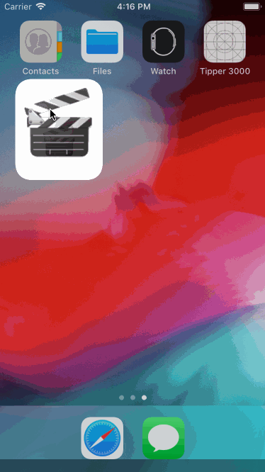

# Flix

Flix is an app that allows users to browse movies from the [The Movie Database API](http://docs.themoviedb.apiary.io/#).

## Flix Part 2

### User Stories

#### REQUIRED (10pts)
- [X] (5pts) User can tap a cell to see more details about a particular movie.
- [X] (5pts) User can tap a tab bar button to view a grid layout of Movie Posters using a CollectionView.

#### BONUS
- [ ] (2pts) User can tap a poster in the collection view to see a detail screen of that movie.
- [ ] (2pts) In the detail view, when the user taps the poster, a new screen is presented modally where they can view the trailer.

### App Walkthrough GIF
 

### Notes
- Trying to get new icons and launch screens was a major hassle:
- Icon/Image sets were extremely difficult to work with, and had to wrestle with build settings to get anything to function. 
- Creating multiple image assets was annoying; It would be so much easier if Xcode just worked off one master high resolution. image that it scaled down, perhaps with different options for extremely low resolution images or versions with transparency.   
- Old launch screen and/or icon kept appearing on tests until Xcode was fully shutdown and restarted.
- Changing the Tab Bar icon color was difficult to find out.
- Custom Colors are still unwieldy to work with, especially across multiple computers. Though I plan on looking into "Color Assets" in the future).

---

## Flix Part 1

#### REQUIRED (10pts)
- [X] (2pts) User sees an app icon on the home screen and a styled launch screen.
- [X] (5pts) User can view and scroll through a list of movies now playing in theaters.
- [X] (3pts) User can view the movie poster image for each movie.

#### BONUS
- [ ] (2pt) User can view the app on various device sizes and orientations.
- [ ] (1pt) Run your app on a real device.

### App Walkthrough GIF

 

### Notes
No major challenges were encountered while building the app.
